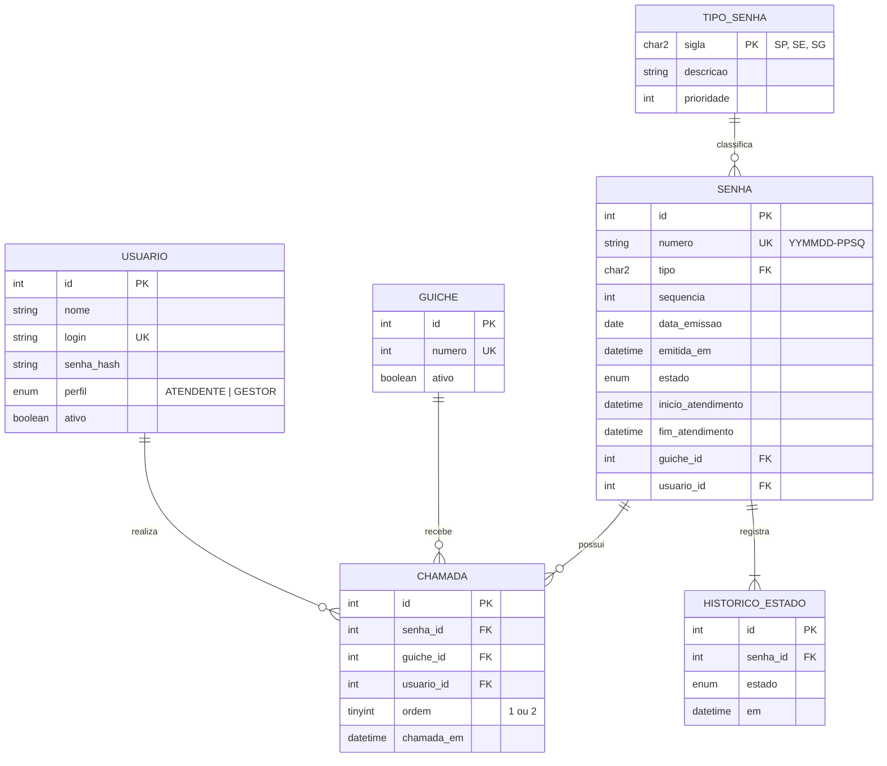

# Modelo Entidade-Relacionamento

```mermaid
erDiagram
    USUARIO ||--o{ CHAMADA : realiza
    GUICHE ||--o{ CHAMADA : recebe
    SENHA ||--o{ CHAMADA : possui
    SENHA ||--|{ HISTORICO_ESTADO : registra
    TIPO_SENHA ||--o{ SENHA : classifica

    USUARIO {
        int id PK
        string nome
        string login UK
        string senha_hash
        enum perfil "ATENDENTE | GESTOR"
        boolean ativo
    }
    GUICHE {
        int id PK
        int numero UK
        boolean ativo
    }
    TIPO_SENHA {
        char2 sigla PK "SP, SE, SG"
        string descricao
        int prioridade
    }
    SENHA {
        int id PK
        string numero UK "YYMMDD-PPSQ"
        char2 tipo FK
        int sequencia
        date data_emissao
        datetime emitida_em
        enum estado
        datetime inicio_atendimento
        datetime fim_atendimento
        int guiche_id FK
        int usuario_id FK
    }
    CHAMADA {
        int id PK
        int senha_id FK
        int guiche_id FK
        int usuario_id FK
        tinyint ordem "1 ou 2"
        datetime chamada_em
    }
    HISTORICO_ESTADO {
        int id PK
        int senha_id FK
        enum estado
        datetime em
    }
```

O esquema SQL correspondente está em `schema.sql` (MySQL 8.0). No protótipo atual, os dados ficam em memória; o banco entra na próxima fase.
