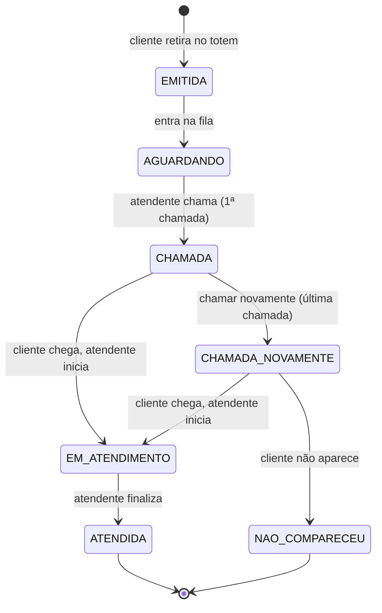

# Máquina de estados da senha

```mermaid
stateDiagram-v2
    [*] --> EMITIDA : cliente retira no totem
    EMITIDA --> AGUARDANDO : entra na fila
    AGUARDANDO --> CHAMADA : atendente chama (1ª chamada)
    CHAMADA --> CHAMADA_NOVAMENTE : chamar novamente (última chamada)
    CHAMADA --> EM_ATENDIMENTO : cliente chega, atendente inicia
    CHAMADA_NOVAMENTE --> EM_ATENDIMENTO : cliente chega, atendente inicia
    CHAMADA_NOVAMENTE --> NAO_COMPARECEU : cliente não aparece
    EM_ATENDIMENTO --> ATENDIDA : atendente finaliza
    ATENDIDA --> [*]
    NAO_COMPARECEU --> [*]
```

Senhas que continuam em AGUARDANDO ao fim do expediente (17h) são descartadas.
